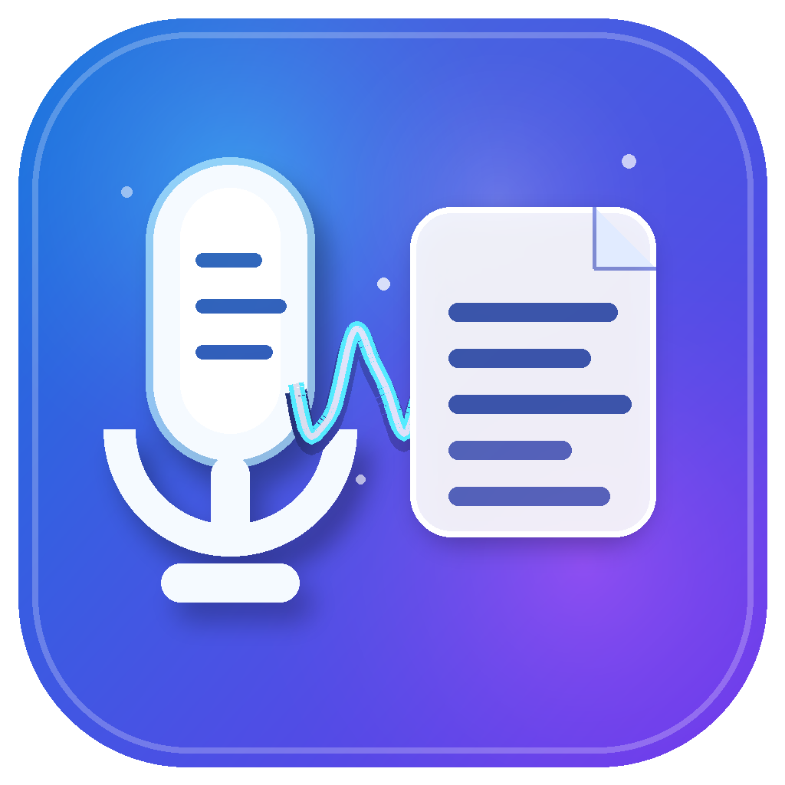
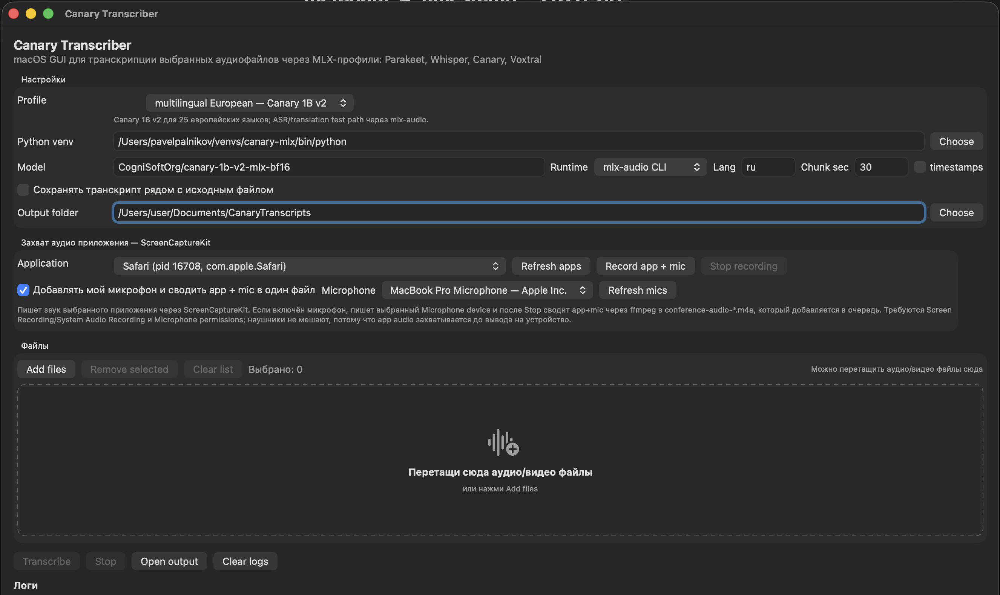

# Canary Transcriber

A small native macOS SwiftUI app for batch transcription of existing audio files with local MLX speech-to-text profiles.



##Screenshot



## Features

- Native macOS SwiftUI interface.
- Select one or multiple audio/video files.
- Add files with a file picker or drag and drop them into the file list.
- Capture audio from a specific running macOS application via ScreenCaptureKit, similar to OBS Studio's **macOS Audio Capture**; optionally record your microphone too, mix app+mic into one `.m4a`, then add it to the transcription queue.
- Uses an external Python venv with profile-specific MLX packages.
- Built-in model profiles:
  - `fast — Parakeet v3`: `mlx-community/parakeet-tdt-0.6b-v3` via `mlx-audio`.
  - `fast — Whisper Turbo`: `mlx-community/whisper-large-v3-turbo` via `mlx-whisper`.
  - `accurate — Whisper large-v3`: `mlx-community/whisper-large-v3-mlx` via `mlx-whisper`.
  - `multilingual European — Canary 1B v2`: `CogniSoftOrg/canary-1b-v2-mlx-bf16` via `mlx-audio`.
- Russian transcription support for Canary v2 uses explicit `source_lang=ru` and `target_lang=ru` so the model transcribes Russian instead of translating to English.
  - `realtime — Voxtral Mini Realtime`: `mlx-community/Voxtral-Mini-4B-Realtime-2602-4bit` via `mlx-audio`.
- Default language: `ru`.
- Normalizes input with `ffmpeg` to 16 kHz mono PCM WAV.
- Manual fixed-size chunking for long recordings to avoid empty output and MLX/Metal memory issues.
- Writes outputs next to the source file or into a selected output folder:
  - `<source>.canary.txt`
  - `<source>.canary.json`
- Keeps a persistent troubleshooting log:
  - `~/Documents/CanaryTranscripts/canary-transcriber.log`

## Requirements

- macOS 14 or newer.
- Apple Silicon Mac recommended for MLX.
- `ffmpeg` available on the system.
- Python virtual environment with the runtime package for the selected profile installed.

### Install runtime dependencies

```bash
brew install ffmpeg
python3 -m venv ~/venvs/canary-mlx
~/venvs/canary-mlx/bin/python -m pip install --upgrade pip
~/venvs/canary-mlx/bin/python -m pip install canary-mlx mlx-whisper 'mlx-audio[stt]'
```

If you only use the legacy `qfuxa/canary-mlx` runtime, `canary-mlx` is enough. Parakeet/Canary v2/Voxtral profiles need `mlx-audio`; Whisper profiles need `mlx-whisper`.

The app defaults to this Python path:

```text
/Users/pavelpalnikov/venvs/canary-mlx/bin/python
```

You can change it in the UI or launch the app with:

```bash
CANARY_MLX_PYTHON_BIN=/path/to/venv/bin/python open "Canary Transcriber.app"
```

## Installation from release assets

### Option A: DMG installer

1. Download `CanaryTranscriber.dmg` from the [latest release](../../releases/latest).
2. Open the DMG.
3. Drag **Canary Transcriber.app** to **Applications**.
4. Launch it from Applications.
5. If macOS blocks the first launch because the app is ad-hoc signed and not notarized:
   - open **System Settings → Privacy & Security**;
   - allow **Canary Transcriber**;
   - launch it again.

### Option B: ZIP fallback

If the DMG path is inconvenient, download `CanaryTranscriber.app.zip`, unzip it, and move **Canary Transcriber.app** to `/Applications` manually.

## Usage

### File transcription

1. Open **Canary Transcriber**.
2. Confirm the `Python venv` field points to a Python where the selected profile runtime imports successfully.
3. Add audio/video files with **Add files**, or drag and drop files directly into the file list.
4. Choose a `Profile`:
   - `fast — Parakeet v3` for the default fast local STT path.
   - `fast — Whisper Turbo` for a fast Whisper-compatible path.
   - `accurate — Whisper large-v3` for quality-first transcription.
   - `multilingual European — Canary 1B v2` for Canary multilingual testing.
   - `realtime — Voxtral Mini Realtime` for the realtime-oriented Voxtral model in batch-file mode.
5. Keep defaults unless needed:
   - `Model`: auto-filled by the profile, but editable.
   - `Runtime`: auto-filled by the profile, but editable.
   - `Lang`: `ru`
   - `Chunk sec`: `30`
6. Click **Transcribe**.
7. Find outputs next to the source files or in the selected output folder.

### Capture audio from a running app

1. Start audio playback or join a call in the target app, for example Zoom, Teams, Safari, Chrome, Telegram, etc.
2. In **Захват аудио приложения — ScreenCaptureKit**, click **Refresh apps** and select the target application.
3. Leave **Добавлять мой микрофон и сводить app + mic в один файл** enabled if you want your own speech included.
4. Choose a specific **Microphone** device, or leave **System default microphone**.
5. Click **Record app + mic**.
6. On first use, allow Canary Transcriber in macOS **System Settings → Privacy & Security → Screen & System Audio Recording** / **Screen Recording** and **Microphone** if prompted.
7. Click **Stop recording** when finished.
8. The app saves app-only `.m4a`, mic-only `.caf`, and mixed `.m4a` artifacts under `~/Documents/CanaryTranscripts/AppAudioCaptures/`; the mixed `conference-audio-*.m4a` is automatically added to the file list.
9. Click **Transcribe** to process the captured conference audio with the selected MLX profile.

This path captures the selected app before audio reaches the output device, so it works while listening through headphones. It does not require BlackHole/Loopback. App audio uses ScreenCaptureKit; microphone recording uses AVAudioEngine for the selected CoreAudio input device, then `ffmpeg` `amix` after Stop. The mix is microphone-priority: app audio is attenuated and microphone audio is noise-filtered, dynamically normalized, and boosted before limiting. This avoids ScreenCaptureKit `.microphone` dropping mic samples when the captured app is also producing audio. If the selected app is audible through speakers, the physical microphone may still pick it up; use headphones to avoid acoustic bleed.

For MLX/Metal memory errors, lower `Chunk sec` to `15` or `10`.

## Build from source

```bash
git clone https://github.com/DdemiurgeE/canary-transcriber.git
cd canary-transcriber
swift build --product canary-transcriber
```

Run directly from SwiftPM:

```bash
swift run canary-transcriber
```

Build the local `.app` bundle:

```bash
./scripts/build-canary-transcriber-app.sh
open "dist/Canary Transcriber.app"
```

Build the DMG installer and ZIP fallback:

```bash
./scripts/build-installer-dmg.sh
open dist/CanaryTranscriber.dmg
```

Checksums are written to:

```text
dist/CanaryTranscriber.dmg.sha256
dist/CanaryTranscriber.app.zip.sha256
```

## Project structure

```text
Package.swift
Sources/CanaryTranscriber/main.swift
assets/canary-transcriber/CanaryTranscriber.icns
assets/canary-transcriber/CanaryTranscriberIcon-1024.png
scripts/build-canary-transcriber-app.sh
scripts/build-installer-dmg.sh
```

## Notes on signing and notarization

The build scripts use local ad-hoc signing:

```bash
codesign --force --deep --sign - "dist/Canary Transcriber.app"
```

This is enough for local use and DMG distribution, but it is **not notarized** by Apple. For broad distribution, sign with an Apple Developer ID certificate and notarize the app/DMG.

## Troubleshooting

### `ffmpeg not found`

Install ffmpeg:

```bash
brew install ffmpeg
```

The app also sets a GUI-safe PATH for subprocesses:

```text
/opt/homebrew/bin:/usr/local/bin:/usr/bin:/bin:/usr/sbin:/sbin
```

### Python is not executable / runtime package missing

Verify your venv:

```bash
/Users/pavelpalnikov/venvs/canary-mlx/bin/python - <<'PY'
from canary_mlx import load_model
print('canary_mlx import OK')
PY
```

For other profiles, verify the matching package:

```bash
/Users/pavelpalnikov/venvs/canary-mlx/bin/python - <<'PY'
import mlx_whisper
print('mlx_whisper import OK')
PY

/Users/pavelpalnikov/venvs/canary-mlx/bin/python - <<'PY'
import mlx_audio
print('mlx_audio import OK')
PY
```

Then set that exact Python path in the UI.

### Empty transcript for long audio

This app avoids Canary's problematic full-file path by normalizing audio and transcribing fixed WAV chunks. Some chunks can still be legitimately empty if they contain silence/end padding. Inspect the `.canary.json` file for per-chunk `chars` and `text` records.

### Logs

Persistent logs are written to:

```text
~/Documents/CanaryTranscripts/canary-transcriber.log
```
