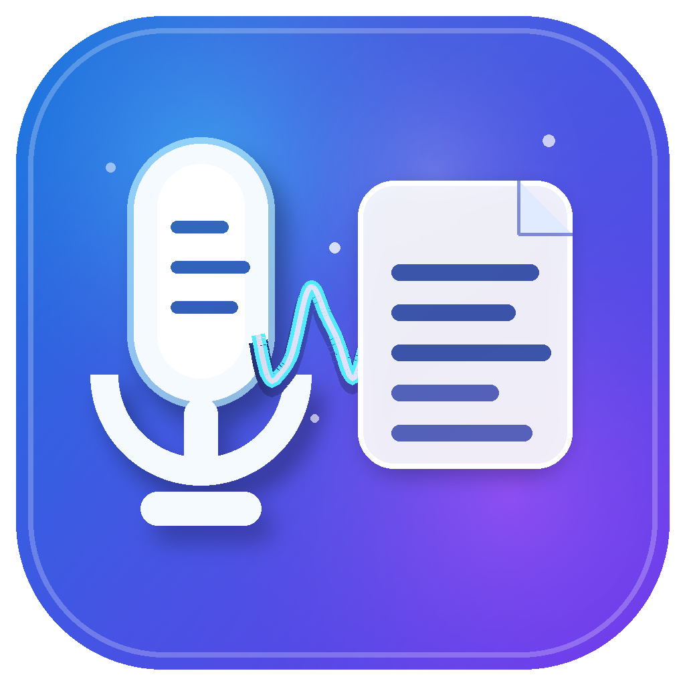
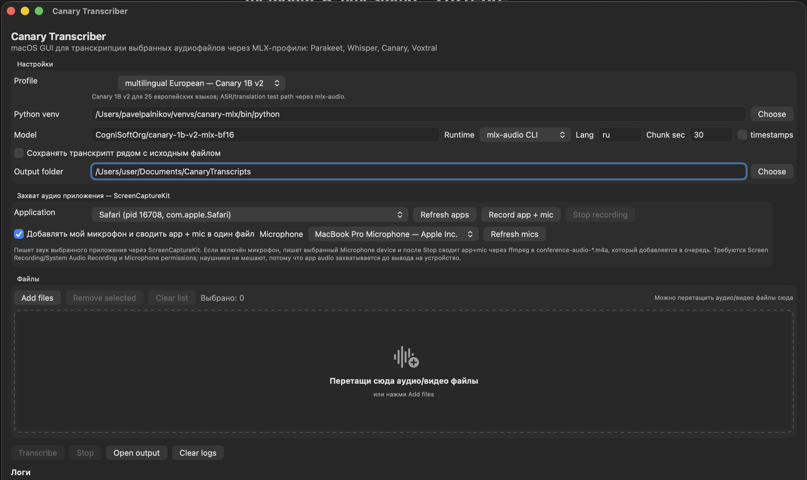

# Canary Transcriber

A small native macOS SwiftUI app for batch transcription with local MLX speech-to-text profiles.

The latest published release is **[v0.7.6](../../releases/tag/v0.7.6)**. It adds Live Capture with five-second app+microphone segments, local MLX transcription, live transcript updates, and incremental `.canary.txt/.json/.md` export.






## Features

- Native macOS SwiftUI interface.
- Select one or multiple audio/video files.
- Add files with a file picker or drag and drop them into the file list.
- Capture audio from a specific running macOS application via ScreenCaptureKit, similar to OBS Studio's **macOS Audio Capture**; optionally record your microphone too, mix app+mic into one `.m4a`, then add it to the transcription queue.
- Uses a typed transcription process runner with live stdout/stderr events, tracked cancellation of the Python process tree, recoverable per-file results, and mixed-success batch reporting.
- Retries oversized MLX/Metal chunks with smaller chunk plans instead of failing the entire batch.
- Validates transcription configuration before starting and keeps unknown runtime events visible in the log.
- Separates SwiftUI panels, the observable `TranscriptionViewModel`, ScreenCaptureKit capture, microphone recording, and ffmpeg mixing into testable components.
- Uses an external Python venv with profile-specific MLX packages.
- Built-in model profiles:
  - `fast — Parakeet v3`: `mlx-community/parakeet-tdt-0.6b-v3` via `mlx-audio`.
  - `fast — Whisper Turbo`: `mlx-community/whisper-large-v3-turbo` via `mlx-whisper`.
  - `accurate — Whisper large-v3`: `mlx-community/whisper-large-v3-mlx` via `mlx-whisper`.
  - `multilingual European — Canary 1B v2`: `CogniSoftOrg/canary-1b-v2-mlx-bf16` via `mlx-audio`.
  - Russian transcription support for Canary v2 uses explicit `source_lang=ru` and `target_lang=ru` so the model transcribes Russian instead of translating to English.
  - `realtime — Voxtral Mini Realtime`: `mlx-community/Voxtral-Mini-4B-Realtime-2602-4bit` via `mlx-audio`.
- Default language: `ru`.
- Normalizes input with `ffmpeg` to 16 kHz mono PCM WAV.
- Manual fixed-size chunking for long recordings to avoid empty output and MLX/Metal memory issues.
- Writes outputs next to the source file or into a selected output folder:
  - `<source>.canary.txt`
  - `<source>.canary.json`
  - `<source>.canary.md` (structured meeting workspace when diarization is enabled)
- When diarization is enabled, Settings also accepts optional speaker aliases like `SPEAKER_00 = Alice` and stores them locally so they reappear on the next launch.
- Optional pyannote diarization reports progress, validates segments, and falls back to speakerless transcription when short or unusable audio produces no segments.
- Keeps a persistent troubleshooting log:
  - `~/Documents/CanaryTranscripts/canary-transcriber.log`
- Checks for app updates via [Sparkle](https://sparkle-project.org), with a **Check for Updates…** menu item and EdDSA-signed releases published to GitHub. See [Release quality](docs/testing.md#auto-update-sparkle-release-step) for the release-side signing step.

## Requirements

- macOS 14 or newer.
- Apple Silicon Mac recommended for MLX.
- `ffmpeg` available on the system.
- Python virtual environment with the runtime package for the selected profile installed.

### Install runtime dependencies

```bash
brew install ffmpeg
python3 -m venv ~/venvs/canary-mlx
~/venvs/canary-mlx/bin/python -m pip install --upgrade pip
~/venvs/canary-mlx/bin/python -m pip install canary-mlx mlx-whisper 'mlx-audio[stt]'
```

If you only use the legacy `qfuxa/canary-mlx` runtime, `canary-mlx` is enough. Parakeet/Canary v2/Voxtral profiles need `mlx-audio`; Whisper profiles need `mlx-whisper`.

The app defaults to this Python path:

```text
~/venvs/canary-mlx/bin/python
```

The app accepts an override at launch:

```bash
CANARY_MLX_PYTHON_BIN=/path/to/venv/bin/python open "Canary Transcriber.app"
```

## Installation from release assets

### Option A: DMG installer

1. Download `CanaryTranscriber.dmg` from the [latest release](../../releases/latest).
2. Open the DMG.
3. Drag **Canary Transcriber.app** to **Applications**.
4. Launch it from Applications.
5. If macOS blocks the first launch because the app is ad-hoc signed and not notarized:
   - open **System Settings → Privacy & Security**;
   - allow **Canary Transcriber**;
   - launch it again.

### Option B: ZIP fallback

If the DMG path is inconvenient, download `CanaryTranscriber.app.zip`, unzip it, and move **Canary Transcriber.app** to `/Applications` manually.

## Usage

### File transcription

1. Open **Canary Transcriber**.
2. Confirm the `Python venv` field points to a Python where the selected profile runtime imports successfully.
3. Add audio/video files with **Add files**, or drag and drop files directly into the file list.
4. Choose a `Profile`:
   - `fast — Parakeet v3` for the default fast local STT path.
   - `fast — Whisper Turbo` for a fast Whisper-compatible path.
   - `accurate — Whisper large-v3` for quality-first transcription.
   - `multilingual European — Canary 1B v2` for Canary multilingual testing.
   - `realtime — Voxtral Mini Realtime` for the realtime-oriented Voxtral model in batch-file mode.
5. Keep defaults unless needed:
   - `Model`: read-only value supplied by the selected profile.
   - `Runtime`: selected profile runtime.
   - `Lang`: `ru`
   - `Chunk sec`: `30`
6. Click **Transcribe**.
7. Find outputs next to the source files or in the selected output folder.

### Capture audio from a running app

1. Start audio playback or join a call in the target app, for example Zoom, Teams, Safari, Chrome, Telegram, etc.
2. In **App Audio Capture — ScreenCaptureKit**, click **Refresh apps** and select target application.
3. Use **Record app audio only** or **Record app audio + microphone** icon button.
4. Choose a specific **Microphone** device, or leave **System default microphone**.
5. On first use, allow Canary Transcriber in macOS **System Settings → Privacy & Security → Screen & System Audio Recording** / **Screen Recording** and **Microphone** if prompted.
6. Click **Stop recording** when finished.
7. The app saves app-only `.m4a`, mic-only `.caf`, and mixed `.m4a` artifacts under `~/Documents/CanaryTranscripts/AppAudioCaptures/`; the mixed `conference-audio-*.m4a` is automatically added to the file list.
8. Click **Transcribe** to process the captured conference audio with the selected MLX profile.

This path captures the selected app before audio reaches the output device, so it works while listening through headphones. It does not require BlackHole/Loopback. App audio uses ScreenCaptureKit; microphone recording uses AVAudioEngine for the selected CoreAudio input device, then `ffmpeg` `amix` after Stop. The mix is microphone-priority: app audio is attenuated and microphone audio is noise-filtered, dynamically normalized, and boosted before limiting. This avoids ScreenCaptureKit `.microphone` dropping mic samples when the captured app is also producing audio. If the selected app is audible through speakers, the physical microphone may still pick it up; use headphones to avoid acoustic bleed.

For MLX/Metal memory errors, lower `Chunk sec` to `15` or `10`.

### Live Capture

Live Capture transcribes a running app while it is recording:

1. Open **App Audio Capture — ScreenCaptureKit**.
2. Click **Refresh apps** and select the target application.
3. Select a microphone, or leave **System default microphone**.
4. Click the waveform-plus button to start five-second live segments.
5. Allow Screen Recording and Microphone permissions when macOS asks.
6. Watch the **Live Transcript** panel while the local MLX runtime processes each closed segment.
7. Click Stop. The transcript is continuously saved under `~/Documents/CanaryTranscripts/LiveCaptures/` as `.canary.txt`, `.canary.json`, and `.canary.md`.

Live Capture uses local processing only. If the MLX runtime is slower than the capture rate, segments remain serialized to avoid concurrent Metal model access.

## Build from source

```bash
git clone https://github.com/DdemiurgeE/canary-transcriber.git
cd canary-transcriber
swift test
swift build --product canary-transcriber
```

Run directly from SwiftPM:

```bash
swift run canary-transcriber
```

Build the local `.app` bundle:

```bash
./scripts/build-canary-transcriber-app.sh
open "dist/Canary Transcriber.app"
```

Build the DMG installer and ZIP fallback:

```bash
./scripts/build-installer-dmg.sh
open dist/CanaryTranscriber.dmg
```

Checksums are written to:

```text
dist/CanaryTranscriber.dmg.sha256
dist/CanaryTranscriber.app.zip.sha256
```

Validate the complete local release bundle, including the English bundle region, ad-hoc signature, installer assets, and SHA-256 checksums:

```bash
EXPECTED_VERSION=0.5.2 ./scripts/validate-release.sh
```

To validate generated transcription JSON as well, set `CANARY_OUTPUT_DIR` to a directory containing `.canary.json` files.

## Project structure

```text
Package.swift
Sources/CanaryTranscriberCore/       # typed pipeline contracts, chunking, diarization, Markdown
Sources/CanaryTranscriberLib/        # SwiftUI, ViewModel, embedded runtime, capture services
Sources/CanaryTranscriberApp/main.swift
Tests/CanaryTranscriberTests/
assets/canary-transcriber/CanaryTranscriber.icns
assets/canary-transcriber/CanaryTranscriberIcon-1024.png
scripts/build-canary-transcriber-app.sh
scripts/build-installer-dmg.sh
scripts/generate-appcast.sh
scripts/smoke-test-runtime.sh
scripts/validate-release.sh
docs/runtime-profiles.md
docs/testing.md
docs/appcast.xml              # served via GitHub Pages as the Sparkle update feed
.swiftlint.yml
```

## Notes on signing and notarization

The build scripts use local ad-hoc signing:

```bash
codesign --force --deep --sign - "dist/Canary Transcriber.app"
```

This is enough for local use and DMG distribution, but it is **not notarized** by Apple. For broad distribution, sign with an Apple Developer ID certificate and notarize the app/DMG.

## Documentation

- [Runtime profiles](docs/runtime-profiles.md)
- [Testing and verification](docs/testing.md)

## Troubleshooting

### `ffmpeg not found`

Install ffmpeg:

```bash
brew install ffmpeg
```

The app also sets a GUI-safe PATH for subprocesses:

```text
/opt/homebrew/bin:/usr/local/bin:/usr/bin:/bin:/usr/sbin:/sbin
```

### Python is not executable / runtime package missing

Verify your venv:

```bash
~/venvs/canary-mlx/bin/python - <<'PY'
from canary_mlx import load_model
print('canary_mlx import OK')
PY
```

For other profiles, verify the matching package:

```bash
~/venvs/canary-mlx/bin/python - <<'PY'
import mlx_whisper
print('mlx_whisper import OK')
PY

~/venvs/canary-mlx/bin/python - <<'PY'
import mlx_audio
print('mlx_audio import OK')
PY
```

Then set that exact Python path in the UI.

### Empty transcript for long audio

This app avoids Canary's problematic full-file path by normalizing audio and transcribing fixed WAV chunks. Some chunks can still be legitimately empty if they contain silence/end padding. Inspect the `.canary.json` file for per-chunk `chars` and `text` records.

### Logs

Persistent logs are written to:

```text
~/Documents/CanaryTranscripts/canary-transcriber.log
```

### Swift core and embedded Python Markdown boundary

`Sources/CanaryTranscriberCore/MeetingWorkspace.swift` is the tested Swift Markdown seam. The production transcription process still runs the embedded Python runtime assembled by `TranscriptionViewModel`; the Swift renderer is not yet the runtime writer. This is an intentional transitional extraction: both implementations must preserve the same escaping and fallback semantics until the runtime is migrated to the Swift core. The integration tests extract and compile the embedded script so protocol changes cannot silently break.
